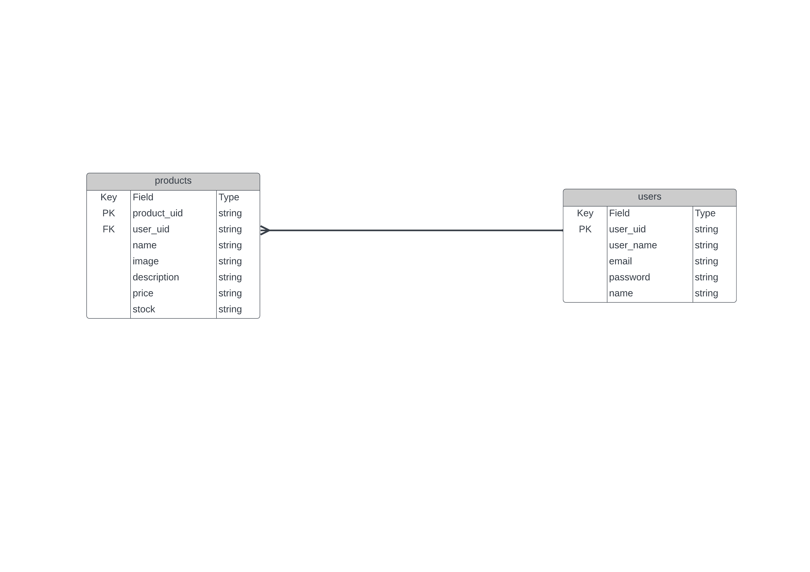
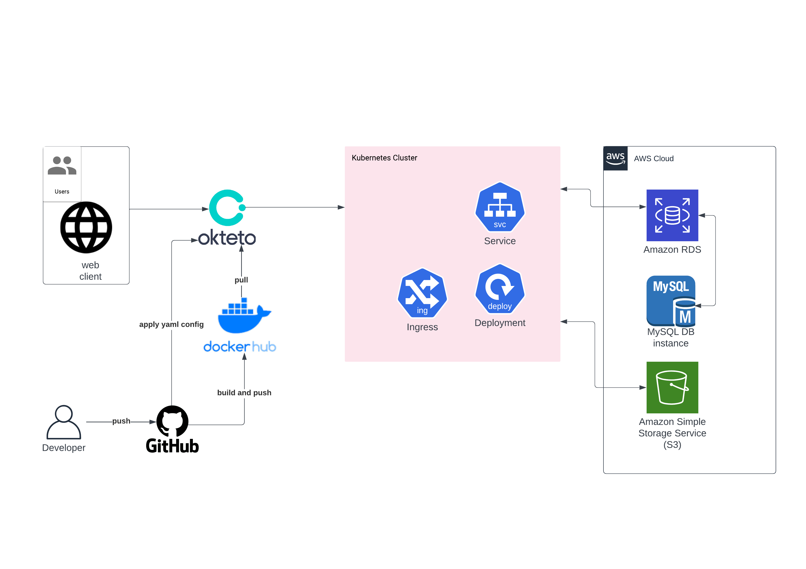

# simple api

## Tech Stack

[](https://github.com/labstack/echo)
[](https://pkg.go.dev/gorm.io/gorm?tab=doc)
[](https://github.com/awsdocs/aws-doc-sdk-examples/tree/main/go/example_code/s3)

[OPEN API](https://app.swaggerhub.com/apis/faliqadlan/simple_api/1.0.0-oas3)

[POSTMANT](https://app.getpostman.com/join-team?invite_code=6f3882e5cbe848756e6092ae1da4c01f&target_code=caacbce1308cdc5235798d61c97e631a)

<details>
<summary>ERD</summary>

</details>
<details>
<summary>HLA</summary>

</details>
<details>
<summary>User</summary>

| Feature Doctor | Endpoint | Query Param | Request Body         | JWT Token | Utility                               |
| -------------- | -------- | ----------- | -------------------- | --------- | ------------------------------------- |
| POST           | /login   | -           | indentity & password | NO        | login user with indentity & passwords |
| POST           | /doctor  | -           | \_                   | NO        | register user                         |

</details>
<details>
<summary>Product</summary>

| Feature Patient | Endpoint | Query Param      | Request Body | JWT Token | Utility                |
| --------------- | -------- | ---------------- | ------------ | --------- | ---------------------- |
| POST            | /product | -                | \_           | YES       | add product            |
| DELETE          | /product | -                | -            | YES       | delete current product |
| PUT             | /product | -                | -            | YES       | update current product |
| GET             | /product | product_uid, all | -            | YES       | get current product    |

</details>
<p align="right">(<a href="#top">back to top</a>)</p>

# How to Use

### 1. install

```bash
git clone https://github.com/faliqadlan/sagara_test.git
```

### 2.1 create file .env

```bash
touch .env
```

### 2.2 open .env

```
nano .env
```

### 2.3 write .env

```bash
PORT=8080
DB=mysql
DB_Name=<database name>
DB_PORT=3306
DB_HOST=localhot
DB_USERNAME=<username>/root
DB_PASSWORD=<password>
DB_LOC=Local
S3_REGION=<reqion AWS S3>/ap-southeast-1
S3_ID=<KEY ID AWS S3>
S3_SECRET=<SECRETKEY AWS S3>
```

# Contact

[](https://mail.google.com/)
[](https://github.com/faliqadlan)
[](https://www.linkedin.com/in/faliqa/)


<p align="right">(<a href="#top">back to top</a>)</p>